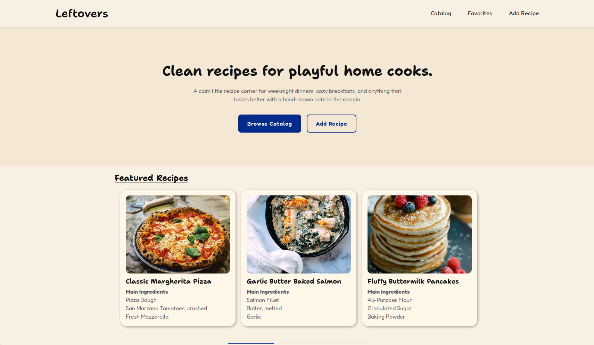

# Leftovers

Clean recipes for playful home cooks. A calm little recipe corner for
weeknight dinners, cozy breakfasts, and anything that tastes better with a
hand-drawn note in the margin.



## Preview

[View Live Demo](https://Meatra0704.github.io/Leftovers)

## Features

- Browse a catalog of recipes
- Add your own recipes with ingredients, steps, and an image
- Mark recipes as favorites
- View full recipe details
- Data persists between sessions via `localStorage`

## Tech Stack

- React + React Router
- Context API for global state
- Vite
- Nix flake for reproducible dev environment and deployment

## Running Locally

### Option 1: Nix (recommended)

If you have [Nix](https://nixos.org/download) installed with flakes enabled,
run the app directly without cloning or installing anything manually:

```sh
nix run github:reponame/project
```

This builds and serves the app at `http://localhost:3000`.

### Option 2: Manual setup

Requires Node.js 24+.

```sh
git clone https://github.com/reponame/project.git
cd project
npm install
npm run dev
```

## Project Structure

```
src/
├── components/   # Reusable UI components (Button, RecipeCard, Navbar, etc.)
├── context/      # RecipeContext — global recipe state and localStorage sync
├── data/         # Mock recipe data used on first load
├── pages/        # Route-level views (Home, Catalog, AddRecipe, Favorites, etc.)
├── styles/       # Global styles and CSS reset
├── App.jsx
└── main.jsx
```

## Documentation

A project report covering approach, React concepts used, and challenges
faced is available at [`docs/report.typ`](./docs/report.typ).
